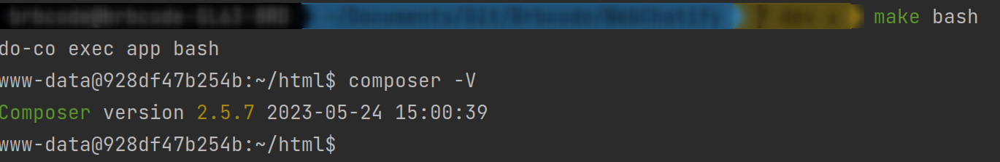
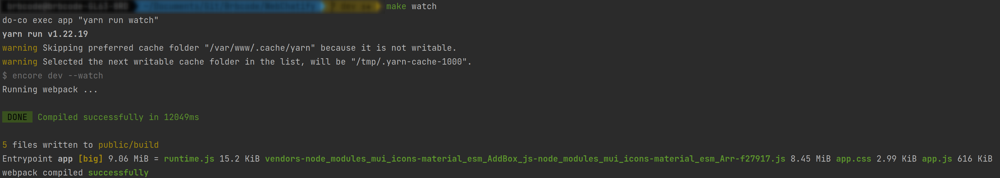
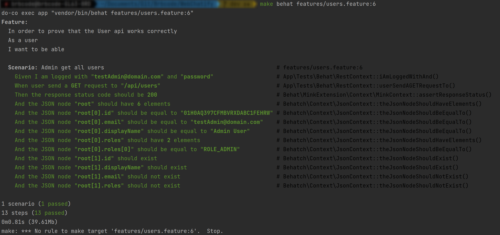

# Makefile commands

| Command             | Definition                                                                                                 |
|---------------------|------------------------------------------------------------------------------------------------------------|
| ``make up``         | Start Docker containers in detached mode                                                                   |
| ``make down``       | Stop Docker containers                                                                                     |
| ``make rebuild``    | Rebuild Docker containers                                                                                  |
| ``make init``       | Prepare project, install composer and yarn dependencies, build react project and create necessary SSL keys |
| ``make bash``       | Run Bash shell connected with base container ``app``                                                       |
| ``make watch``      | Start watch react changes                                                                                  |
| ``make db``         | Rebuild database and fill with fixtures                                                                    |
| ``make db-test``    | Similar to ``make db`` but using ``test`` environment                                                      |
| ``make behat``      | Run behat tests. (Able to specify test with arguments)                                                     |
| ``make behat-full`` | Similar to ``make behat-full`` but before run test rebuild test database                                   |
| ``make version``    | Displays the versions of PHP, Symfony, Node.js, and Yarn installed inside the ``app`` container.           |

## Example usage
### Command ``make bash``
This command is useful to install/remove composer or yarn packages, make migrations or run yarn scripts

To use just run ``make bash`` inside your preferred console, then ``app bash shell`` will be attached and you will be able
to run any command inside docker container like:


### Command ``make watch``
This command is so useful when you are developing something in front-end with react.


### Command ``make behat`` and ``make behat-full``
To run all tests just run ``make behat`` or ``make behat-full``.

But if you want run a specific feature test just run:
- ``make behat features/<feature file>.feature`` 
- ``make behat-full features/<feature file>.feature``

And you also can run a specific scenario from feature test running: 
- ``make behat features/<feature file>.feature:<line>``
- ``make behat-full features/<feature file>.feature:<line>``



## Docker compatibility
By default ``Makefile`` uses ``do-co`` command but if you use other command just create a new file:

```makefile
# Makefile.local

DOCKER_CMD = #insert your command here ex: docker compose
```